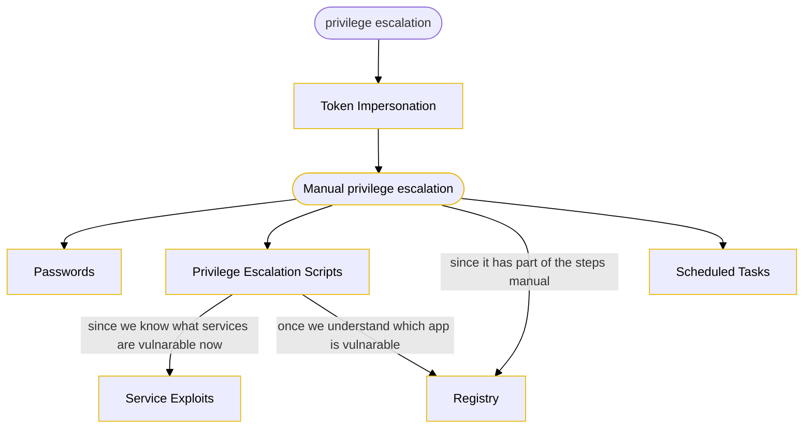

### methodology

#### [1- reverse shell generation and file transfer](5-%20Templates/04%20Post%20Exploitation/02%20Windows%20privilege%20escalation/1-%20reverse%20shell%20generation%20and%20file%20transfer.md)

#### [2- Token Impersonation](5-%20Templates/04%20Post%20Exploitation/02%20Windows%20privilege%20escalation/2-%20Token%20Impersonation.md)

#### [3- Manual privilege escalation (windows)](5-%20Templates/04%20Post%20Exploitation/02%20Windows%20privilege%20escalation/3-%20Manual%20privilege%20escalation%20(windows).md)

#### [4- Scheduled Tasks](5-%20Templates/04%20Post%20Exploitation/02%20Windows%20privilege%20escalation/4-%20Scheduled%20Tasks.md)

#### [5- Privilege Escalation Scripts (Windows→ winPEAS)](5-%20Templates/04%20Post%20Exploitation/02%20Windows%20privilege%20escalation/5-%20Privilege%20Escalation%20Scripts%20(Windows→%20winPEAS).md)

#### [6- Password](5-%20Templates/04%20Post%20Exploitation/02%20Windows%20privilege%20escalation/6-%20Password.md)

#### [7- Service Exploits](5-%20Templates/04%20Post%20Exploitation/02%20Windows%20privilege%20escalation/7-%20Service%20Exploits.md)

#### [8- Registry](5-%20Templates/04%20Post%20Exploitation/02%20Windows%20privilege%20escalation/8-%20Registry.md)

